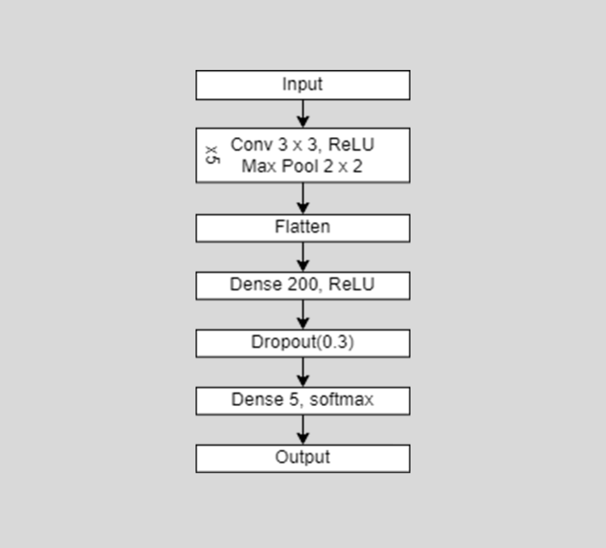

# PreDiSkin

## Description

PrediSkin is a web-based application (powered by Flask) that serves as an intelligent guide for individuals to self-manage and treat skin diseases. Its main objectives are to reduce the risk of misdiagnosis by leveraging machine learning predictions, which are then sent for verification by connected dermatologists within the application. Additionally, this application aims to enhance the effectiveness and efficiency of healing mechanisms by providing personalized treatment recommendations. Moreover, the application offers comprehensive disease information in a specific and scholarly format, ensuring reliable and detailed insights rather than a generic blog-style approach.

## Methodology
**Convolutional Neural Network**

The model used is a Convolutional Neural Network (CNN). The CNN architecture used in this study is a conventional Conv-Pool-Conv-Pool architecture with an increase in the number of filters at each stage.

